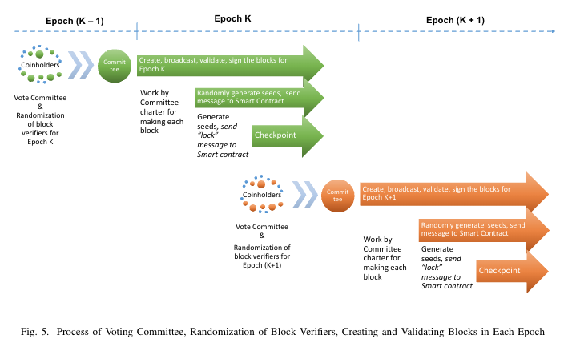

# Tomochain

Date: May 31, 2023

# Consensus



## Coin holder và Masternodes

- Coin holder là người nắm Tomo
- Masternodes là node deposit vô 50000 TOMO → Trở thành Masternode candidates → coin holder vote (bằng cách gửi tiền vô smart contract) thì trở thành Masternodes


## Double validation

### Single validation


### Double validation


- M1 là block creator, M2 là block verifier, M3 là block creator tiếp theo
- M1 là attacker → tạo ra garbage block. M2 sẽ không sign lên block đó → Block đó bị bỏ → M3 check thấy chỉ có 1 chữ kí nên bỏ
- M1 và M2 là attacker. M3 validate lại block đó thấy invalid nên bỏ
- Nếu M3 là attacker luôn thì sẽ bị hack.

## Block creator và block verifier

`m` là số lượng masternodes (150), `n` là số slot trong 1 epoch (1 epoch có 900 slot)

### Block creator

- Được chọn theo lượt
  
  
  Mỗi Vi là một cặp PrK/PuK. Public key là distributed

### Random algorithm

- Random số
  - Mỗi masternode tạo một array gồm `n + 1` số random gọi là `Recommend` . `r` trong đoạn từ 1 → m (150)
    
  - Sau đó encrypt lại. Dùng thuật toán AES
    
  - Ký lên Secret bằng ECDSA. → gọi là `lock` message
  - Gửi `lock` message đã kí lên Smart contract. (Public key được public toàn bộ network)
- Recovery phase
  - Mục tiêu để reveal `lock` message
  - Chỉ có thể reveal lock message khi toàn bộ node đều gửi lock message tới smart contract hoặc là sau khi quá thời gian
  - Mỗi masternode open `lock` bằng cách gửi `unlock` message tới smart contract để các masternodes open các `lock` tương ứng.
  - `Unlock` message chứa `key` để các masternodes khác
  - Nếu có master node gửi `lock` mà không thể gửi `unlock` tương ứng thì các masternode khác có thể ignore `lock` đó và cho tất cả = 1.
- Tạo thành matrix và tính toán
  - `Recommend` của mỗi V tương ứng sẽ hợp lại thành 1 matrix `m x n` . Còn `theta` cuối cùng thì tạo thành `m x 1` matrix.
    
  - Đem ma trận này `v2'` mod `m` ta sẽ có được 1 ma trận `n x 1` . Là thứ tự các `Block verifier`

## Final block

Một block irreversible khi mà nó nhân được 3/4 chứ kí của toàn bộ masternodes committee.


## Algorithm


`C` là chuỗi các block `Bi-1 -> Bi -> Bi+1`

Có một masternode committee `VC` .

Epoch đầu tiên `e1`

Generate array của masternode thứ 2 (block verifier)

Add genesis block vào blockchain.

- Trong 1 epoch
  `block creator` tạo block
  Đưa vào block chain
  Được `block verifier` validate và sign
  Broadcast ra toàn mạng để validate
  Nếu ≥3/4 masternodes ký thì `block` được final
- Khi số Block mod n (n là số slot trong 1 epoch) = 0
  Đến checkpoint, tạo snapshot
  Vote cho những masternodes cho epoch tiếp theo
  Generate array của masternode thứ 2 (block verifier)

# Run node Tomo

## Install

### Golang

[https://go.dev/dl/](https://go.dev/dl/)

Golang MacOS - amd64

Set GOROOT và GOPATH (tuỳ máy)

```bash
export GOROOT=/usr/local/go
export GOPATH=$HOME/go
```

### Tomo

Install và cài thư viện

```bash
git clone https://github.com/tomochain/tomochain/
cd tomochain
go mod tidy -e
make all
```

2 thư viện deprecated (chưa gây ra vấn đề):


Alias cho các file build của tomo:

```bash
alias tomo=./build/bin/tomo
alias puppeth=./build/bin/puppeth
alias bootnode=./build/bin/bootnode
```

## Setup node and account

- Create nodes file
  ```bash
  mkdir nodes
  cd nodes
  mkdir 1
  mkdir 2
  mkdir 3
  cd ..
  ```
- Create account hoặc import account (dùng private key)
  ```bash
  mkdir keystore
  touch [PASSWORD_FILE]
  echo "abc" >> [PASSWORD_FILE]
  ```
  - Create new account:
    ```bash
    tomo account new \
          --password [YOUR_PASSWORD_FILE_TO_LOCK_YOUR_ACCOUNT] \
          --keystore $HOME/tomochain/keystore/1
    ```
  - Import account:
    ```bash
    tomo  account import [PRIVATE_KEY_FILE_OF_YOUR_ACCOUNT] \
        --keystore $HOME/tomochain/keystore/1 \
        --password [YOUR_PASSWORD_FILE_TO_LOCK_YOUR_ACCOUNT]
    ```

## Create genesis file with `puppeth`

- Run `puppeth`
  ```bash
  puppeth
  ```
- Set chain name
- Enter 2 to configure new genesis
- Enter 3 to select `POSV` consensus
- Set blocktime (default 2 seconds)
- Set reward of each epoch
- Set addresses to be initial masternodes
- Set number of blocks of each epoch (default 900). If you would like to customize epoch number, please update code here `common/constants.go:14` `EpocBlockRandomize = 900`
- Set gap (How many blocks before checkpoint need prepare new masternodes set ?)`suggestedGap = 5`
- Enter foundation address which you hold private key
- Enter accounts which you control private keys to unlock MultiSig wallet (Foundation and Team wallet)
- Enter swap wallet address for fund 55 million TOMO
- Export genesis file - Select `2. Manage existing genesis` - Select `2. Export genesis configuration` - Enter genesis filename

## Init node with genesis file

```bash
tomo --datadir nodes/1 init [PATH/TO/GENESIS_FILE]
tomo --datadir nodes/2 init [PATH/TO/GENESIS_FILE]
tomo --datadir nodes/3 init [PATH/TO/GENESIS_FILE]
```

## Setup bootnode

- Init bootnode key
  ```bash
  bootnode -genkey bootnode.key
  ```
- Start bootnode
  ```bash
  bootnode -nodekey ./bootnode.key
  ```
  Lấy được bootnode info

## Run node

- Node 1
  ```bash
  tomo --syncmode "full" \
  --datadir nodes/1 --networkid 3172 --port 10303 \
  --keystore keystore/1 --password pw.json \
  --rpc --rpccorsdomain "*" --rpcaddr 0.0.0.0 --rpcport 1545 --rpcvhosts "*" \
  --rpcapi "admin,db,eth,net,web3,personal,debug" \
  --gcmode "archive" \
  --ws --wsaddr 0.0.0.0 --wsport 1546 --wsorigins "*" --unlock "0x79d3620f9379d043eaea262f1cac689fc906d5a1" \
  --identity "NODE1" \
  --mine --gasprice 2500 \ --bootnodesv5 "enode://d2bb804ef44d29fa98a422d2cebaded916641f6fc78cb8f5bb666748ac7c22cc8019b7f4ce19aac76b89d9943686d1cebd34fe2230063fa1ffdb82ce5b939bb5@[::]:30301" \
  console
  ```
- Node 2
  ```bash
  tomo --syncmode "full" \
  --datadir nodes/2 --networkid 3172 --port 20303 --nodiscover \
  --keystore keystore/2 --password pw.json \
  --rpc --rpccorsdomain "*" --rpcaddr 0.0.0.0 --rpcport 2545 --rpcvhosts "*" \
  --rpcapi "admin,db,eth,net,web3,personal,debug" \
  --gcmode "archive" \
  --ws --wsaddr 0.0.0.0 --wsport 2546 --wsorigins "*" --unlock "0x756a6142dd54dd0b19cc6589cffd81b23e67171b" \
  --identity "NODE2" \
  --mine --gasprice 2500 \ --bootnodesv5 "enode://d2bb804ef44d29fa98a422d2cebaded916641f6fc78cb8f5bb666748ac7c22cc8019b7f4ce19aac76b89d9943686d1cebd34fe2230063fa1ffdb82ce5b939bb5@[::]:30301" \
  console
  ```
- Node 3
  ```bash
  tomo --syncmode "full" \
  --datadir nodes/3 --networkid 3172 --port 30303 --nodiscover \
  --keystore keystore/3 --password pw.json \
  --rpc --rpccorsdomain "*" --rpcaddr 0.0.0.0 --rpcport 3545 --rpcvhosts "*" \
  --rpcapi "admin,db,eth,net,web3,personal,debug" \
  --gcmode "archive" \
  --ws --wsaddr 0.0.0.0 --wsport 3546 --wsorigins "*" --unlock "0x8bc6e6ca7443699613d36267b7ac089100267d2a" \
  --identity "NODE3" \
  --mine --gasprice 2500 \ --bootnodesv5 "enode://d2bb804ef44d29fa98a422d2cebaded916641f6fc78cb8f5bb666748ac7c22cc8019b7f4ce19aac76b89d9943686d1cebd34fe2230063fa1ffdb82ce5b939bb5@[::]:30301" \
  console
  ```

## Connect node to sync and execute

- Open IPC node 1
  ```bash
  tomo attach nodes/1/tomo.ipc
  ```
- Lấy thông tin node info → Lấy encode
  ```bash
  admin.nodeInfo
  ```
  
- Open IPC của node 2:
  ```bash
  tomo attach nodes/2/tomo.ipc
  ```
- Add node 1 vào peers
  ```bash
  admin.addPeer("enode://3499d673e80770534444f3ef51db4bd13e1778f3c31d4f295d04234fa06acc33b8deabc588791ebebdaee4fe7cf750167e40e825dce7639c61cae4237e636ee0@[::]:10303")
  ```
- Kiểm tra:
  ```bash
  admin.peers
  ```
  Nếu không rỗng là thành công
  

→ Khi đó node 1 và node 2 đã kết nối sync thành công và có thể commit block

- Làm tương tự đưa node 3 vào mạng.

→ Ta được mạng với 3 master node

# Add new validator

- Để dễ dàng theo dõi các block và transaction thì dùng web của bên thứ 3 là: [https://tryethernal.com/](https://tryethernal.com/)
- Đăng kí account và Connect vào network ở:
  ```bash
  http://localhost:1545
  ```
- Sau khi connect vào mạng thì ta vào tab `Contract`
  
- Chọn `Import Contract`
- Import address `0x0000000000000000000000000000000000000088`
- Ta cần truyền ABI vào cho contract để có thể tương tác
  
- Mở tomoscan và vào phần contract để copy ABI: [https://tomoscan.io/address/0x0000000000000000000000000000000000000088#contract](https://tomoscan.io/address/0x0000000000000000000000000000000000000088#contract)
- Thêm ABI manually.
- Sau khi connect với metamask:
  
- Query những candidate masternodes hiện tại:
  
- Propose address thành masternode candidate:
  
  
- Sau khi kết thúc 1 epoch, masternodes sẽ được chọn ra từ masternode candidate.
